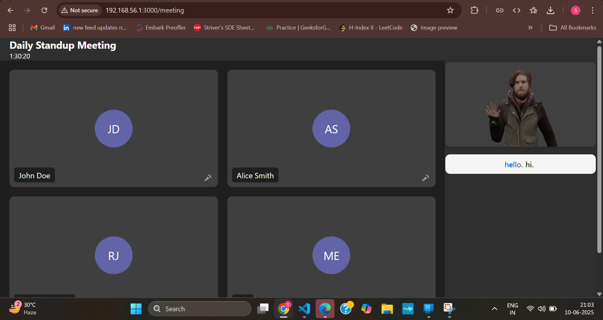

# Clone or navigate to your project directory first

# 🧏‍♂️ ASL Integration for Online Meeting Platforms

**Enhancing accessibility by converting speech to American Sign Language (ASL) in real-time**  
This project integrates ASL interpretation into video conferencing platforms (like Microsoft Teams) using Azure Speech-to-Text and a React-based interface.

---

## 📁 Project Structure

```
.
├── frontend/     # React meeting UI with ASL video rendering
├── server/       # Flask backend (uses Azure Speech-to-Text API)
└── README.md
```

---

## 🚀 Quick Start (One Terminal Setup)

````bash
# ---------- SETUP BACKEND ----------
cd server
python -m venv venv
pip install -r requirements.txt || pip install flask flask-cors azure-cognitiveservices-speech

# Set up environment variables
echo "AZURE_SPEECH_KEY=your_api_key" >> .env
echo "AZURE_SERVICE_REGION=your_service_region" >> .env

# Start the backend server
python app.py &

# ---------- SETUP FRONTEND ----------
cd ../frontend
npm install
npm run start


## 🔌 API Configuration

In `server/.env`, make sure the following variables are set:

```env
AZURE_SPEECH_KEY=your_api_key
AZURE_SERVICE_REGION=your_service_region
````

---

## 🖼 Screenshots

### 🔵 ASL Integrated Meeting UI


### 🔴 Real-time ASL Interpretation



## 📹 Project Working

[Click to watch the working](working.mp4)
